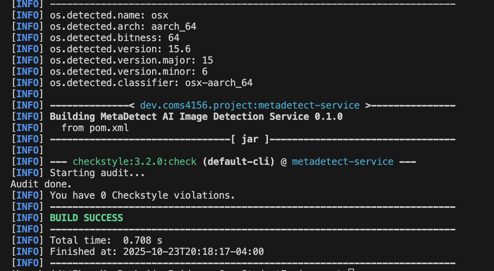
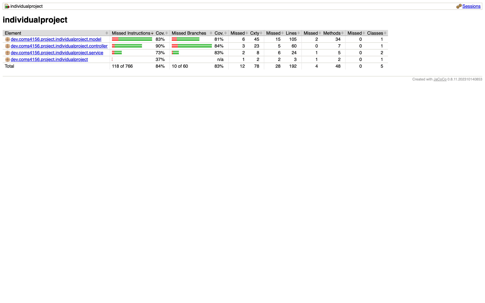
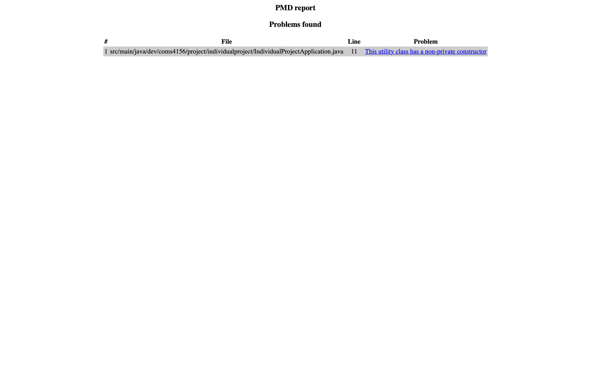

# MetaDetect-API (AdvanceJavaStudentEngineers)
This is the public repo for posting our project for the COMS4156 class.

## Viewing the Repository
Please use the following link to view the repository: https://github.com/Jalen-Stephens/AdvanceJavaStudentEngineers

## 🐳 Docker (Quick Testing)

Build and run with Docker:
```bash
docker build -t metadetect .
docker run -p 8080:8080 -e SPRING_DATASOURCE_URL=<your-db-url> -e SPRING_DATASOURCE_USERNAME=<user> -e SPRING_DATASOURCE_PASSWORD=<pass> -e SUPABASE_URL=<url> -e SUPABASE_ANON_KEY=<key> -e SUPABASE_JWT_SECRET=<secret> metadetect
```

## Building and Running a Local Instance
In order to build and use this project you must install the following:

1. Maven 3.9.11: https://maven.apache.org/download.cgi Download and follow the installation instructions, be sure to set the bin as described in Maven's README as a new path variable by editing the system variables if you are on windows or by following the instructions for MacOS.
2. JDK 18: This project used JDK 18 for development so that is what I recommend you use: https://www.oracle.com/java/technologies/javase/jdk18-archive-downloads.html
3. IntelliJ IDE: I recommend using IntelliJ but you are free to use any other IDE that you are comfortable with: https://www.jetbrains.com/idea/download/?section=windows
4. When you open IntelliJ you have the option to clone from a GitHub repo, click the green code button and copy the http line that is provided there and give it to your IDE to clone.
5. That should be it in order to build the project with maven you can run <code>mvn -B package --file pom.xml</code> and then you can either run the tests via the test files described below or the main application by running AdvanceJavaStudentEngineers.java from your IDE.
6. If you wish to run the style checker you can with <code>mvn checkstyle:check</code> or <code>mvn checkstyle:checkstyle</code> if you wish to generate the report.
7. For static bug checking using **PMD**, see the official site: https://pmd.github.io


My endpoints are listed below in the "Endpoints" section, with brief descriptions of their parameters. 

## Running Tests
---------------------------------------------------------------------
My unit tests are located under the directory 'src/test'. To run my project's tests in IntelliJ using Java 18, you must first build the project.

From there, you can right-click any of the classes present in the src/test directory and click run to see the results.

From the terminal, run the following CLI commands:
```bash
    ## Run Unit Tests
    mvn clean test

    ## Run Jacoco, can only be done after unit tests run
    mvn jacoco:report

    ## Run PMD static debugger
    mvn pmd:pmd

    ## Run Checkstyle
    mvn checkstyle:checkstyle
    ## OR
    mvn checkstyle:check
```
## How to Run
---------------------------------------------------------------------

1. **Create environment file:**  
   In your project directory, create a file named `env.pooler.sh` (see email for keys).

2. **Set environment variables in terminal:**
   ```bash
   set -a
   source env.pooler.sh
   set +a
   ```

3. **Compile Maven project:**
   ```bash
   mvn compile
   ```

4. **Run Spring Boot application:**
   ```bash
   mvn spring-boot:run
   ```

---

## Running the Application with Docker
---------------------------------------------------------------------

### 🐳 What is Docker?
Docker packages your application and its dependencies into a container so that it runs identically across any environment. It’s a portable and lightweight runtime environment — ideal for ensuring consistent deployments.

### 📦 What the Dockerfile Does
The `Dockerfile` builds the MetaDetect image in two stages:
1. **Build Stage:**  
   - Uses a Maven + Java 17 base image.  
   - Copies the source files and builds the JAR via `mvn clean package -DskipTests`.  
2. **Runtime Stage:**  
   - Uses a lightweight Java 17 runtime.  
   - Copies the built JAR and required C2PA binaries.  
   - Exposes port `8080` and runs the application.

This keeps the final image small and production-ready.

### ⚙️ Prerequisites
Before running the application with Docker:
1. **Install Docker Desktop:** [https://www.docker.com/products/docker-desktop](https://www.docker.com/products/docker-desktop)
2. **Create a `.env` file** at the root of the project containing environment variables:
   ```env
   SPRING_DATASOURCE_URL=jdbc:postgresql://your-database-host:5432/postgres
   SPRING_DATASOURCE_USERNAME=your-username
   SPRING_DATASOURCE_PASSWORD=your-password
   SUPABASE_URL=https://your-project.supabase.co
   SUPABASE_ANON_KEY=your-anon-key
   SUPABASE_JWT_SECRET=your-jwt-secret
   ```
   ⚠️ Do **not** include quotation marks around any values.  
   ⚠️ Do **not** commit your `.env` file to Git.

---

### 🚀 How to Build and Run

**Step 1: Build the Docker Image**
```bash
docker build -t metadetect .
```

**Step 2: Run the Container**
```bash
docker run -p 8080:8080 --env-file .env metadetect
```

**Step 3: Access the API**
- API: [http://localhost:8080](http://localhost:8080)  
- Swagger UI: [http://localhost:8080/swagger-ui.html](http://localhost:8080/swagger-ui.html)  **Not yet implemented**
- API Docs: [http://localhost:8080/api-docs](http://localhost:8080/api-docs)  **Not yet implemented**

---

### 🧰 Useful Docker Commands

| Action | Command |
|--------|----------|
| Run in background | `docker run -d -p 8080:8080 --env-file .env --name metadetect-app metadetect` |
| View logs | `docker logs -f metadetect-app` |
| Stop container | `docker stop metadetect-app` |
| Start container | `docker start metadetect-app` |
| Remove container | `docker rm metadetect-app` |
| List running containers | `docker ps` |
| Rebuild after code changes | `docker build -t metadetect .` |

---

### 🧩 Troubleshooting

- **Port 8080 already in use** → Use another port:  
  `docker run -p 8081:8080 --env-file .env metadetect`
- **Cannot connect to Docker daemon** → Ensure Docker Desktop is running.
- **Connection refused / Database errors** → Check `.env` file values and ensure DB is accessible.
- **401 Unauthorized** → Normal. The API requires a JWT token for protected routes.

---

### 🧱 Development vs. Production
- For **local development**, you can still run the app with:
  ```bash
  mvn spring-boot:run
  ```
- For **production**, Docker ensures consistent runtime behavior across environments.

---

### 📊 Image Size Overview
Final image size: ~400–500 MB  
Includes:
- Java 17 JRE  
- Compiled JAR  
- C2PA binaries  
- Minimal Linux libraries  

---

### ✅ Summary
To containerize and run MetaDetect:
```bash
docker build -t metadetect .
docker run -p 8080:8080 --env-file .env metadetect
```

That’s it — your application is now running inside Docker! 🐋

---

## Endpoint Access Instructions
---------------------------------------------------------------------

**NOTE: Endpoints 1 and 2 MUST be run before you can access any other endpoints**

### 1️⃣ **Sign Up**
**POST** `/auth/signup`

```bash
curl -X POST http://localhost:8080/auth/signup   -H "Content-Type: application/json"   -d '{
    "email": "testuser@example.com",
    "password": "passwordPassword"
  }'
```

---

### 2️⃣ **Log In**
**POST** `/auth/login`

```bash
curl -X POST http://localhost:8080/auth/login   -H "Content-Type: application/json"   -d '{
    "email": "testuser@example.com",
    "password": "passwordPassword"
  }'
```

✅ **Response:**  
You’ll receive a **JWT access token** to authenticate future requests.

---

### 3️⃣ **Upload an Image**
**POST** `/api/images/upload`

```bash
curl -X POST "http://127.0.0.1:8080/api/images/upload"   -H "Authorization: Bearer YOUR_JWT_TOKEN_HERE"   -H "Content-Type: multipart/form-data"   -F "file=@/absolute/path/to/your/image.png"
```

📦 **Expected Response:**
```json
{
  "id": "05921763-7aed-41c8-bbf4-3e0b58ba50fc",
  "filename": "image.png",
  "userId": "XXXXXXXX-XXXX-XXXX-XXXX-XXXXXXXXXXXX",
  "uploadedAt": "2025-10-23T21:05:27.698012Z",
  "labels": [],
  "note": null
}
```

---

### 4️⃣ **Analyze an Image**
**POST** `/api/analyze/{image_id}`

```bash
curl -X POST "http://127.0.0.1:8080/api/analyze/{image_id}"   -H "Authorization: Bearer YOUR_JWT_TOKEN_HERE"   -H "Content-Type: application/json"
```

📦 **Expected Response:**
```json
{
  "analysisId": "56fcf948-d7f7-40a3-a3fd-3c4cca5ffa66"
}
```

---

### 5️⃣ **Get Manifest**
**GET** `/api/analyze/{analysis_id}/manifest`

```bash
curl -s -X GET "http://127.0.0.1:8080/api/analyze/{analysis_id}/manifest"   -H "Authorization: Bearer YOUR_JWT_TOKEN_HERE"
```

📦 **Expected Response:**
```json
{
  "analysisId": "XXXXXXXXX-XXXX-XXXX-XXXX-XXXXXXXXXXXX",
  "manifestJson": "{ ... full C2PA manifest ... }"
}
```

---


## Running **PMD** Debugger
---------------------------------------------------------------------
In Temrinal, home directory: Followed Website 
cd $HOME
curl -OL https://github.com/pmd/pmd/releases/download/pmd_releases%2F7.16.0/pmd-dist-7.16.0-bin.zip
unzip pmd-dist-7.16.0-bin.zip
alias pmd="$HOME/pmd-bin-7.16.0/bin/pmd"

In code directory:/Users/jalenstephens/Desktop/Advance Software Engineering/4156-Miniproject-2025-Students/IndividualProject
Cd in to code directory

Ran to generate report:
$HOME/pmd-bin-7.16.0/bin/pmd check -d src/main/java,src/test/java -R rulesets/java/quickstart.xml -f text -r pmd-report.txt


## MetaDetect Endpoints
---------------------------------------------------------------------
This section describes the endpoints provided by the metadetect service, including their inputs and outputs.

POST /auth/signup
- Input Parameters:
  - Headers: Content-Type: application/json
  - Body: { "email": string, "password": string }
- Expected Output: Raw JSON returned by Supabase Auth (user/session)
- Upon Success:
  - HTTP 200 with Supabase’s JSON
- Upon Failure:
  - HTTP 4xx/5xx mirrored from Supabase with raw JSON body

POST /auth/login
- Input Parameters:
  - Headers: Content-Type: application/json
  - Body: { "email": string, "password": string }
- Expected Output: Raw Supabase JSON (e.g., access_token, refresh_token, user)
- Upon Success:
  - HTTP 200 with Supabase’s JSON
- Upon Failure:
  - HTTP 4xx/5xx mirrored from Supabase with raw JSON body

POST /auth/refresh
- Input Parameters:
  - Headers: Content-Type: application/json
  - Body: { "refreshToken": string }
- Expected Output: Raw Supabase JSON containing refreshed tokens
- Upon Success:
  - HTTP 200 with Supabase’s JSON
- Upon Failure:
  - HTTP 400 with {"error":"missing refreshToken"} if body missing/invalid
  - HTTP 4xx/5xx mirrored from Supabase with raw JSON body

GET /auth/me
- Input Parameters:
  - Headers: Authorization: Bearer <JWT>
- Expected Output: { "id": string, "email": string (optional) }
- Upon Success:
  - HTTP 200 with the current user’s id (and email when present)
- Upon Failure:
  - HTTP 401 for missing/invalid token


GET /api/images
- Input Parameters:
  - Headers: Authorization: Bearer <JWT>
  - Query: page (int, default 0), size (int, default 5)
- Expected Output: Array of Image objects:
  - [{ id, filename, userId, uploadedAt, labels: string[], note: string|null }]
- Upon Success:
  - HTTP 200 with the array of images (may be empty)
- Upon Failure:
  - HTTP 400 for invalid paging arguments (page < 0 or size <= 0)
  - HTTP 401 for missing/invalid token

GET /api/images/{id}
- Input Parameters:
  - Headers: Authorization: Bearer <JWT>
  - Path: id (UUID)
- Expected Output: Image object { id, filename, userId, uploadedAt, labels, note }
- Upon Success:
  - HTTP 200 with the image metadata
- Upon Failure:
  - HTTP 400 for invalid UUID format
  - HTTP 403 if the image is not owned by the caller
  - HTTP 404 if the image does not exist
  - HTTP 401 for missing/invalid token

POST /api/images/upload
- Input Parameters:
  - Headers: Authorization: Bearer <JWT>, Content-Type: multipart/form-data
  - Form Data: file (required) — image file (.png, .jpg, .jpeg, etc.)
- Expected Output: Image object { id, filename, userId, uploadedAt, labels, note }
- Upon Success:
  - HTTP 201 with the created image metadata (storage path persisted server-side)
- Upon Failure:
  - HTTP 400 for missing/invalid form data
  - HTTP 401 for missing/invalid token
  - HTTP 413 if file too large
  - HTTP 415 for unsupported media type
  - HTTP 500 for unexpected errors

PUT /api/images/{id}
- Input Parameters:
  - Headers: Authorization: Bearer <JWT>, Content-Type: application/json
  - Path: id (UUID)
  - Body: { "labels": string[] (optional), "note": string (optional) }
- Expected Output: Updated Image object { id, filename, userId, uploadedAt, labels, note }
- Upon Success:
  - HTTP 200 with the updated image metadata
- Upon Failure:
  - HTTP 400 for invalid UUID or body
  - HTTP 403 if the image is not owned by the caller
  - HTTP 404 if the image does not exist
  - HTTP 401 for missing/invalid token

DELETE /api/images/{id}
- Input Parameters:
  - Headers: Authorization: Bearer <JWT>
  - Path: id (UUID)
- Expected Output: N/A
- Upon Success:
  - HTTP 204 after deleting storage object (if present) and DB row
- Upon Failure:
  - HTTP 400 for invalid UUID
  - HTTP 403 if the image is not owned by the caller
  - HTTP 404 if the image does not exist
  - HTTP 401 for missing/invalid token

GET /api/images/{id}/url
- Input Parameters:
  - Headers: Authorization: Bearer <JWT>
  - Path: id (UUID)
- Expected Output: { "url": string } — short-lived signed URL for private object
- Upon Success:
  - HTTP 200 with the signed URL
- Upon Failure:
  - HTTP 400 for invalid UUID
  - HTTP 403 if the image is not owned by the caller
  - HTTP 404 if image not found or image has no storage object
  - HTTP 401 for missing/invalid token

POST /api/analyze/{imageId}
- Input Parameters:
  - Headers: Authorization: Bearer <JWT>
  - Path: imageId (UUID of an uploaded image you own)
- Expected Output: { "analysisId": string }
- Upon Success:
  - HTTP 202 with analysisId indicating analysis was accepted and executed inline
- Upon Failure:
  - HTTP 400 for invalid UUID or image missing storage_path
  - HTTP 404 if the image does not exist or is not owned by the caller
  - HTTP 401 for missing/invalid token
  - HTTP 500 for unexpected errors

GET /api/analyze/{analysisId}
- Input Parameters:
  - Headers: Authorization: Bearer <JWT>
  - Path: analysisId (UUID)
- Expected Output: { "analysisId": string, "status": "PENDING"|"DONE"|"FAILED", "confidence": number|null }
- Upon Success:
  - HTTP 200 with current status and optional confidence (may be null)
- Upon Failure:
  - HTTP 400 for invalid UUID
  - HTTP 404 if the analysis does not exist or is not owned by the caller
  - HTTP 401 for missing/invalid token

GET /api/analyze/{analysisId}/manifest
- Input Parameters:
  - Headers: Authorization: Bearer <JWT>
  - Path: analysisId (UUID)
- Expected Output: { "analysisId": string, "manifestJson": string }
- Upon Success:
  - HTTP 200 with the stored C2PA manifest JSON
- Upon Failure:
  - HTTP 400 for invalid UUID
  - HTTP 404 if the analysis does not exist or manifest is not available
  - HTTP 401 for missing/invalid token

GET /api/analyze/compare
- Input Parameters:
  - Headers: Authorization: Bearer <JWT>
  - Query: left (UUID), right (UUID)
- Expected Output: { "status": "DONE", "score": number|null, "message": string }
- Upon Success:
  - HTTP 200 with a stubbed comparison response
- Upon Failure:
  - HTTP 400 for invalid/missing UUIDs
  - HTTP 404 if either image does not exist or is not owned by the caller
  - HTTP 401 for missing/invalid token

## Style Checking Report
---------------------------------------------------------------------
I used the tool "checkstyle" to check the style of my code and generate style checking reports. Here is the report as of the day of 10/23/25 (These can be found in the reports folder):



## Branch Coverage Reporting
---------------------------------------------------------------------
I used JaCoCo to perform branch analysis in order to see the branch coverage of the relevant code within the code base. See below
for screenshots demonstrating output.



## Static Code Analysis
I used PMD to perform static analysis on my codebase, see below for the most recent output as of 10/23/2025 (This can be found in the reports folder).




## Continuous Integration Report
---------------------------------------------------------------------
This repository using GitHub Actions to perform continous integration, to view the latest results go to the following link: https://github.com/Jalen-Stephens/AdvanceJavaStudentEngineers/actions

Click on the latest job on the top under "X workflow runs" then Click 'build' under jobs finally click the drop down next to all the action items to read the logs made during their execution.

## Tools used 
---------------------------------------------------------------------
This section includes notes on tools and technologies used in building this project, as well as any additional details if applicable.

* Maven Package Manager
* GitHub Actions CI
  * This is enabled via the "Actions" tab on GitHub.
  * Currently, this just runs a Maven build to make sure the code builds on branch 'main'.
* Checkstyle
  * We use Checkstyle for code reporting. Note that Checkstyle does NOT get run as part of the CI pipeline.
  * For running Checkstyle manually, you can use the "Checkstyle-IDEA" plugin for IntelliJ.
* PMD
  * We are using PMD to do static analysis of our Java code.
  * Originally we were planning on using SonarQube, however we did not do this as it requires us to either pay or setup a server to host a SonarQube instance.
* JUnit
  * JUnit tests get run automatically as part of the CI pipeline.
* JaCoCo
  * We use JaCoCo for generating code coverage reports.
  * Originally we were planning on using Cobertura, however Cobertura does not support our version of Java.
* c2patool
  * We use the open-source c2patool to scrape manifest metadata for determining the usage of AI in generating an image.
  * Coalition for Content Provenance and Authenticity (C2PA). *c2patool (Version 0.23.4)*.  
  * Content Authenticity Initiative, Adobe Systems, 2024.  
  * Available at: https://github.com/contentauth/c2pa-rs