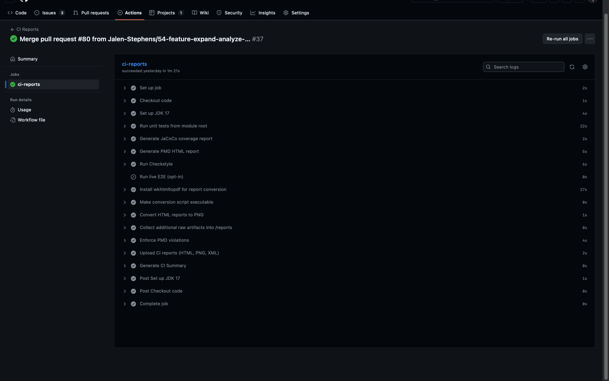
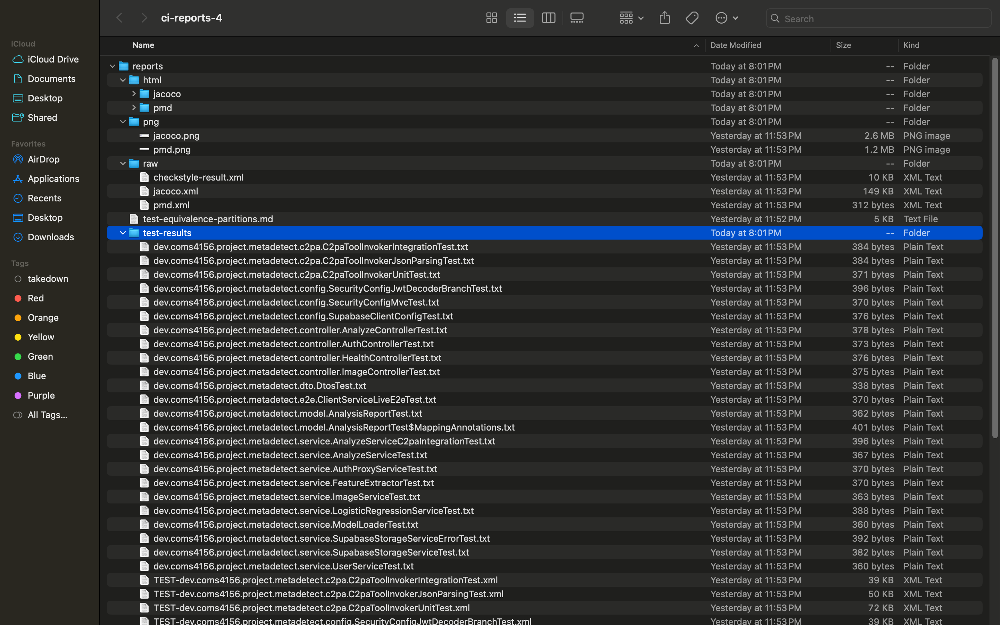
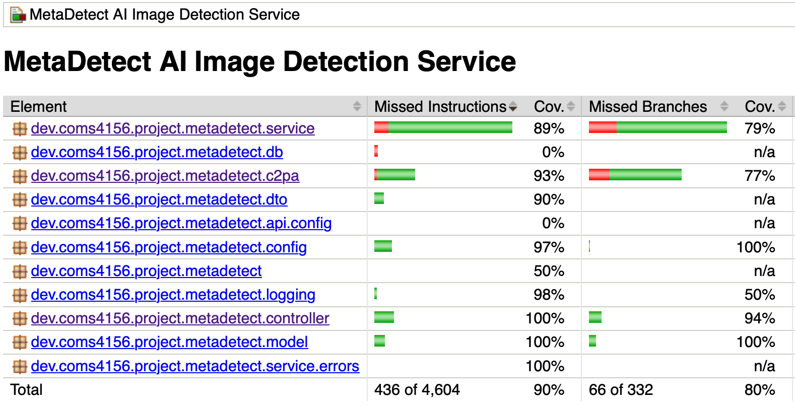

# MetaDetect Service & Pulse Client

MetaDetect is a Spring Boot service that detects AI-generated images and stores user uploads, paired with **Pulse**, a lightweight demo client that exercises the public API. This README is the single entry point for building, running, testing, and integrating both the service and the client.

## Deployments
- **Production (Heroku):** https://meta-detect-service-f2e645d5db2c.herokuapp.com  
  - Pulse is served from the same origin at `/` and `/compose.html`.  
  - All protected routes require a Supabase JWT obtained via `/auth/signup` or `/auth/login`.
- **Local default:** http://localhost:8080 (when run via Maven)

## Repository Map
- `src/main/java/...` — Spring Boot service
- `src/main/resources/static` — Pulse client (served by Spring Boot)
- `src/test/java/dev/coms4156/project/metadetect/e2e/ClientServiceLiveE2eTest.java` — live end-to-end client/service test
- `scripts/` — CI helpers and report tooling
- `reports/` — Snapshots of CI outputs (coverage, PMD with/without issues, equivalence partitions, API testing, storage proofs)
- `tools/c2patool` — Third-party C2PA binaries (see “Third-Party Code”)

## Prerequisites
- JDK 17
- Maven 3.9+
- Supabase project (Auth + Postgres + Storage)

## Configuration (env)
Create an env file (e.g., `env.pooler.sh`) and export before running:
```bash
SPRING_DATASOURCE_URL=jdbc:postgresql://.../postgres
SPRING_DATASOURCE_USERNAME=...
SPRING_DATASOURCE_PASSWORD=...
SUPABASE_URL=https://<your-project>.supabase.co
SUPABASE_ANON_KEY=...
SUPABASE_JWT_SECRET=...
# Optional tuning
SPRING_DATASOURCE_HIKARI_KEEPALIVE_TIME=300000
SPRING_DATASOURCE_HIKARI_CONNECTION_TIMEOUT=10000
```
Then:
```bash
set -a
source env.pooler.sh
set +a
```

## Running the Service Locally
```bash
mvn spring-boot:run
# Service + Pulse available at http://localhost:8080
```

## Pulse Client (demo)
- Location: `src/main/resources/static`
- Default: served by Spring Boot; `config.js` uses same-origin by default.
- Standalone option: `python3 -m http.server 4173 --directory src/main/resources/static` and set `window.APP_CONFIG.apiBaseUrl` in `config.js` to your service base URL.
- Multi-client support: JWTs are issued per user; resources are scoped by `userId`. Clients are distinguished by their bearer tokens, so multiple Pulse instances can run concurrently (each browser session stores its own token under `pulse-demo-token`). Token-per-user scoping is enforced by backend ownership checks on every `/api/images/**` and `/api/analyze/**` route.

### Pulse flows
1) Open `/` for login/signup.  
2) After login, Pulse saves the JWT and redirects to `/compose.html`.  
3) Create posts: upload via `/api/images/upload`, then optional caption/labels via `/api/images/{id}` PUT.  
4) Feed polls signed URLs and analysis status per image; delete posts via `/api/images/{id}` DELETE.

## Testing
- **Unit/Class/Integration/API tests (automated):**  
  ```bash
  mvn clean test
  mvn jacoco:report
  ```  
  Reports: `target/site/jacoco/index.html`, `target/surefire-reports/`.  
  Major units, all API endpoints, and integration seams are covered with valid/invalid/boundary partitions documented in `reports/test-equivalence-partitions.md` (maps inputs to tests per endpoint/unit).
- **Live end-to-end (automated, requires real Supabase/DB/storage):**  
  ```bash
  LIVE_E2E=true mvn -Dtest=dev.coms4156.project.metadetect.e2e.ClientServiceLiveE2eTest test
  ```  
  This signs up, logs in, uploads, lists, analyzes, fetches manifest, and deletes an image against a real stack.
- **Static analysis & style:**  
  ```bash
  mvn checkstyle:checkstyle
  mvn pmd:pmd
  ```  
  Reports: `target/site/checkstyle.html`, `target/site/pmd.html`.
- **Coverage target:** branch coverage goal ≥ 80%. The latest JaCoCo HTML is published in CI artifacts; `reports/MetaDetect80.png` captures the recent run at/near the target (service-only).
- **End-to-end (manual, client+service checklist):**
  1. Start backend with real Supabase env vars.
  2. Open `/` (or `http://localhost:4173` if serving static files separately).
  3. Sign up a fresh user; confirm Supabase JSON response.
  4. Log in; confirm access token saved.
  5. Go to `/compose.html`; upload `src/test/resources/mock-images/Spaghetti.png` with caption/labels.
  6. Verify feed shows the post and signed URL preview.
  7. Delete the post; expect HTTP 204 and removal from feed.
  8. (Optional) Observe AI banner flip after `/api/analyze/{imageId}` reports `DONE`.
- **API smoke (manual):** use the curl examples in “API Reference” to validate auth → upload → analyze → manifest → delete.

## Continuous Integration
- Workflow: `.github/workflows/ci-reports.yml`
- Automates: compile, tests, JaCoCo, Checkstyle, PMD, report screenshotting, artifact upload.
- Artifacts: `ci-reports` (HTML/XML), `ci-reports-screenshots` (PNG), `test-results` (JUnit XML). See `reports/CIPassingReport.png` for the passing CI run and `reports/CIReportDowload.png` for the artifact download view.
- Local CI dry-run: `./scripts/run-ci-locally.sh` (or PowerShell equivalent).
- Triggers: runs on pushes to `main` and on pull requests targeting `main`, executing the full suite (unit + API + integration tests via `mvn -B -ntp clean test`) and quality gates.

### CI Evidence



## Static Analysis & Style (before/after)
- PMD and Checkstyle run across the full codebase in CI.
- PMD before/after evidence: `reports/PMD with issues.png` (initial findings) and `reports/PMD without issues.png` (after fixes). 
- Checkstyle evidence: included in CI run artifacts (see `reports/CIPassingReport.png` / `CIReportDowload.png`); failing findings were fixed and rerun to clean.
- Adjust ruleset via `config/pmd/ruleset.xml`; rerun `mvn pmd:pmd` after fixes.

### Static Analysis Evidence


## API Reference (call order matters)
1) **Sign Up** `POST /auth/signup` — body `{ email, password }` → Supabase JSON (200)  
2) **Log In** `POST /auth/login` — body `{ email, password }` → Supabase JSON with tokens (200)  
3) **Refresh** `POST /auth/refresh` — body `{ refreshToken }` → refreshed tokens (200)  
4) **Me** `GET /auth/me` — bearer token → `{ id, email? }` (200)

**Images**
- `GET /api/images?page&size` — list current user’s images.
- `GET /api/images/{id}` — fetch metadata.
- `POST /api/images/upload` (multipart `file`) — creates image, returns metadata (201).
- `PUT /api/images/{id}` — update `labels` and/or `note`.
- `DELETE /api/images/{id}` — delete image (204).
- `GET /api/images/{id}/url` — signed URL for private object.

**Analysis**
- `POST /api/analyze/{imageId}` — kick off analysis, returns `{ analysisId }` (202).
- `GET /api/analyze/{analysisId}` — status `{ status, confidenceScore? }`.
- `GET /api/analyze/{analysisId}/manifest` — stored C2PA manifest.
- `GET /api/analyze/compare?left&right` — stubbed comparison.

Auth: all `/api/**` and `/auth/me` require `Authorization: Bearer <JWT>`. The service uses Supabase JWKS for token validation.

## Integration Guidance for Third-Party Clients
1. Set API base URL to the deployed service (Heroku URL above).  
2. Implement the auth flow: signup or login, store `access_token`, refresh via `/auth/refresh`.  
3. Include `Authorization: Bearer <token>` on all protected calls.  
4. For uploads: send multipart `file`; optionally follow with `PUT /api/images/{id}` to add labels/caption.  
5. To distinguish multiple clients, keep tokens per user/session (cookies/local storage on the client side); the service enforces per-user ownership on all image/analysis routes.  
6. For signed media: call `/api/images/{id}/url` shortly before rendering (URL is time-limited).  
7. To fetch C2PA metadata: `POST /api/analyze/{imageId}` → poll `/api/analyze/{analysisId}` → `GET /api/analyze/{analysisId}/manifest`.

Sample auth/login:
```bash
curl -X POST https://meta-detect-service-f2e645d5db2c.herokuapp.com/auth/login \
  -H "Content-Type: application/json" \
  -d '{"email":"you@example.com","password":"passwordPassword"}'
```

Sample upload:
```bash
TOKEN=...
curl -X POST https://meta-detect-service-f2e645d5db2c.herokuapp.com/api/images/upload \
  -H "Authorization: Bearer $TOKEN" \
  -F "file=@/absolute/path/to/image.png"
```

## Testing Scope & Partitions (service)
- Auth endpoints: valid creds, invalid email/password combos, missing tokens, expired/invalid JWT.
- Image upload: valid image types, oversized payload (413), missing file (400), unauthorized (401).
- Image metadata update: valid labels/notes, invalid UUID, forbidden access to another user’s image.
- Analysis: valid image IDs with storage, missing storage_path (400), non-owner (403), missing JWT (401).
- Signed URLs: valid owner, non-owner (403), missing file (404).
- Integration/API: DB + storage interactions validated via upload/list/delete; analysis flow exercised end-to-end (see automated `ClientServiceLiveE2eTest` and manual checklist). Component-level integrations include `SupabaseStorageServiceTest` (HTTP to storage via MockWebServer) and `C2paToolInvokerIntegrationTest` / `AnalyzeServiceC2paIntegrationTest` (CLI + service integration).
- Coverage: goal ≥ 80% branch; validate via JaCoCo in CI artifacts. `reports/MetaDetect80.png` captures the latest run near/at the 80% branch threshold (service-only).
- **Equivalence partitions:** see `reports/test-equivalence-partitions.md` for enumerated valid/invalid/edge cases mapped to tests per endpoint/unit.

### Coverage Evidence


## Project Management (Kanban)
Completed tasks per team member are tracked in GitHub Projects: https://github.com/users/Jalen-Stephens/projects/5
- Columns are actively maintained (To Do / In Progress / Done), and issues/cards reflect real assignments and completion states for grading/iteration tracking.

## Third-Party Code
- **c2patool** (Content Authenticity Initiative, Adobe) — vendored binaries under `tools/c2patool`; used for manifest extraction. Source: https://github.com/contentauth/c2pa-rs
- **Supabase** — used as Auth + Postgres + Storage backend (accessed via HTTP APIs/JWKS); configured via environment variables.
- All other dependencies are managed via Maven (`pom.xml`).

## Troubleshooting
- **401 on API calls:** ensure bearer token present and not expired; confirm `SUPABASE_URL`/keys configured.  
- **DB connection errors:** verify `SPRING_DATASOURCE_URL/USERNAME/PASSWORD`; for Heroku, use its config vars.  
- **Large uploads:** `spring.servlet.multipart.max-file-size=10MB` limit; adjust env if needed.  
- **Coverage below target:** inspect `target/site/jacoco/index.html` for missed branches and add tests.
