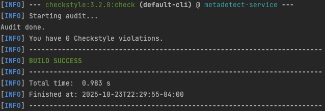
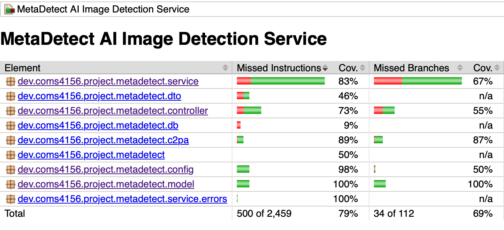
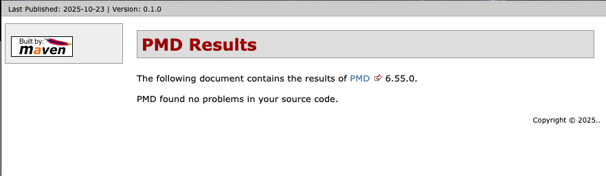

# 4156-Miniproject-2025-Students
This is the public repo for posting the miniproject assignments to the class.

## Viewing the Repository
Please use the following link to view the repository: https://github.com/Jalen-Stephens/Advance-Software-Engineering-Mini-Projects

## 🐳 Docker (Quick Testing)

Build and run with Docker:
```bash
docker build -t metadetect .
docker run -p 8080:8080 -e SPRING_DATASOURCE_URL=<your-db-url> -e SPRING_DATASOURCE_USERNAME=<user> -e SPRING_DATASOURCE_PASSWORD=<pass> -e SUPABASE_URL=<url> -e SUPABASE_ANON_KEY=<key> -e SUPABASE_JWT_SECRET=<secret> metadetect
```

## Building and Running a Local Instance
In order to build and use this project you must install the following:

1. Maven 3.9.11: https://maven.apache.org/download.cgi Download and follow the installation instructions, be sure to set the bin as described in Maven's README as a new path variable by editing the system variables if you are on windows or by following the instructions for MacOS.
2. JDK 18: This project used JDK 18 for development so that is what I recommend you use: https://www.oracle.com/java/technologies/javase/jdk18-archive-downloads.html
3. IntelliJ IDE: I recommend using IntelliJ but you are free to use any other IDE that you are comfortable with: https://www.jetbrains.com/idea/download/?section=windows
4. When you open IntelliJ you have the option to clone from a GitHub repo, click the green code button and copy the http line that is provided there and give it to your IDE to clone.
5. That should be it in order to build the project with maven you can run <code>mvn -B package --file pom.xml</code> and then you can either run the tests via the test files described below or the main application by running IndividualProjectApplication.java from your IDE.
6. If you wish to run the style checker you can with <code>mvn checkstyle:check</code> or <code>mvn checkstyle:checkstyle</code> if you wish to generate the report.
7. For static bug checking using **PMD**, see the official site: https://pmd.github.io


My endpoints are listed below in the "Endpoints" section, with brief descriptions of their parameters. 

## Running Tests
My unit tests are located under the directory 'src/test'. To run my project's tests in IntelliJ using Java 18, you must first build the project.

From there, you can right-click any of the classes present in the src/test directory and click run to see the results.

## Running **PMD** Debugger

In Temrinal, home directory: Followed Website 
cd $HOME
curl -OL https://github.com/pmd/pmd/releases/download/pmd_releases%2F7.16.0/pmd-dist-7.16.0-bin.zip
unzip pmd-dist-7.16.0-bin.zip
alias pmd="$HOME/pmd-bin-7.16.0/bin/pmd"

In code directory:/Users/jalenstephens/Desktop/Advance Software Engineering/4156-Miniproject-2025-Students/IndividualProject
Cd in to code directory

Ran to generate report:
$HOME/pmd-bin-7.16.0/bin/pmd check -d src/main/java,src/test/java -R rulesets/java/quickstart.xml -f text -r pmd-report.txt


## Endpoints
This section describes the endpoints that my mini project uses provides, as well as their inputs and outputs.


## API Endpoints

#### GET / or /index
* **Expected Input Parameters:** None
* **Expected Output:** A plain-text welcome message.
* Returns a simple welcome string with instructions on how to call the API.
* **Upon Success:** HTTP 200 with the welcome text in the response body.
* **Upon Failure:** HTTP 500 with "An unexpected error has occurred" in the response body.

#### GET /book/{id}
* **Expected Input Parameters:** id
* **Expected Output:** A JSON representation of the requested Book object.
* Looks up and returns the details of the book with the specified id.
* **Upon Success:** HTTP 200 with the Book JSON in the response body.
* **Upon Failure:**
    * HTTP 404 with "Book not found." if no matching book exists.
    * HTTP 500 with "An unexpected error has occurred" in the response body.

#### GET /checkout
* **Expected Input Parameters:** id (ex: /checkout?id=3)
* **Expected Output:** A JSON representation of the updated Book object after checkout.
* Attempts to check out one available copy of the specified book. If successful, the book’s state is updated.
* **Upon Success:** HTTP 200 with the updated Book JSON in the response body.
* **Upon Failure:**
    * HTTP 404 with "Book not found." if no matching book exists.
    * HTTP 409 with "No Available Copies!" if the book exists but has no available copies.
    * HTTP 500 with "An unexpected error has occurred" in the response body.

#### GET /books/available
* **Expected Input Parameters:** None
* **Expected Output:** A JSON array of Book objects that currently have at least one available copy.
* Retrieves all books that have available copies.
* **Upon Success:** HTTP 200 with a JSON list of available Book objects.
* **Upon Failure:** HTTP 500 with "Error occurred when getting all available books" in the response body.

#### GET /books/recommendation
* **Expected Input Parameters:** None
* **Expected Output:** A JSON array (up to 10) of Book objects representing recommendations.
* Builds a recommendation list by first adding books with the **lowest** checkout frequency (starting at 0) until 5 items, then adds books with the **highest** checkout frequency until reaching 10 items total (or fewer if not enough books).
* **Upon Success:** HTTP 200 with a JSON list of up to 10 recommended Book objects.
* **Upon Failure:** HTTP 500 with "Error occurred when getting all available books" in the response body.

#### PATCH /book/{id}/add
* **Expected Input Parameters:** id
* **Expected Output:** A JSON representation of the updated Book object.
* Increments the number of available copies for the specified book by one.
* **Upon Success:** HTTP 200 with the updated Book JSON in the response body.
* **Upon Failure:**
    * HTTP 404 with "Book not found." if no matching book exists.
    * HTTP 500 with "Error occurred when adding copy of book" in the response body.


## Style Checking Report
I used the tool "checkstyle" to check the style of my code and generate style checking reports. Here is the report
as of the day of 9/26/25 (These can be found in the reports folder):



## Branch Coverage Reporting
I used JaCoCo to perform branch analysis in order to see the branch coverage of the relevant code within the code base. See below
for screenshots demonstrating output.



## Static Code Analysis
I used PMD to perform static analysis on my codebase, see below for the most recent output.




## Continuous Integration Report
This repository using GitHub Actions to perform continous integration, to view the latest results go to the following link: https://github.com/Jalen-Stephens/Advance-Software-Engineering-Mini-Projects/actions

Click on the latest job on the top under "X workflow runs" then Click 'build' under jobs finally click the drop down next to all the action items to read the logs made during their execution.

## CI Reports (JaCoCo + PMD)
This project generates automated code coverage (JaCoCo) and static analysis (PMD) reports as part of the CI pipeline. To run these reports locally:

```bash
# Run unit tests
mvn clean test

# Generate JaCoCo coverage and PMD analysis reports
mvn jacoco:report pmd:pmd pmd:check

# Convert HTML reports to PNG snapshots
bash scripts/html_to_png.sh
```

The generated PNG reports will be saved to:
- `/reports/jacoco.png` - JaCoCo code coverage report
- `/reports/pmd.png` - PMD static analysis report

These reports are automatically uploaded as GitHub Actions artifacts named "ci-reports" on every push and pull request.

## Tools used 
This section includes notes on tools and technologies used in building this project, as well as any additional details if applicable.

* Maven Package Manager
* GitHub Actions CI
  * This is enabled via the "Actions" tab on GitHub.
  * Currently, this just runs a Maven build to make sure the code builds on branch 'main'.
* Checkstyle
  * We use Checkstyle for code reporting. Note that Checkstyle does NOT get run as part of the CI pipeline.
  * For running Checkstyle manually, you can use the "Checkstyle-IDEA" plugin for IntelliJ.
* PMD
  * We are using PMD to do static analysis of our Java code.
  * Originally we were planning on using SonarQube, however we did not do this as it requires us to either pay or setup a server to host a SonarQube instance.
* JUnit
  * JUnit tests get run automatically as part of the CI pipeline.
* JaCoCo
  * We use JaCoCo for generating code coverage reports.
  * Originally we were planning on using Cobertura, however Cobertura does not support our version of Java.
* c2patool
  * We use the open-source c2patool to scrape manifest metadata for determining the usage of AI in generating an image.
  * Coalition for Content Provenance and Authenticity (C2PA). *c2patool (Version 0.23.4)*.  
  * Content Authenticity Initiative, Adobe Systems, 2024.  
  * Available at: https://github.com/contentauth/c2pa-rs